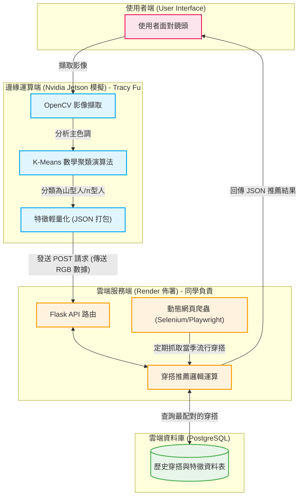

# 智慧極簡衣櫥與穿搭分析鏡 (Smart Wardrobe & Style Persona)

## 專案成員
* 資數三 412170011 傅香瑋
* 資數三 412170360 簡貝珊

---

## 一、研究動機與背景
現代人面臨著「快時尚」帶來的選擇焦慮。我們的實體衣櫥越來越滿，但每天早上面對鏡子時，卻依然不知道該穿什麼，這不僅是收納空間的浪費，更是心靈的負擔。本專案希望將「邊緣運算科技」與「極簡生活哲學」結合，打造一面「懂你的智慧穿搭鏡」，幫助使用者以最少的衣服搭出最高效的風格，讓生活回歸純粹與實用。

## 二、研究目的
本系統旨在透過電腦視覺與數學資料分析，自動解構使用者的穿搭特徵(如主色調)，並將其歸類為特定的「類型」(如：追求多層次與大地穩重感的山型人、講求基礎色系與俐落雙主軸的 π型人)。結合雲端爬蟲與天氣數據，系統能即時提供個性化的穿搭建議，減少使用者的決策疲勞。

## 三、系統架構
本系統採用前後端分離與邊緣運算架構。邊緣端負責沉重的影像處理與數學運算，將結果輕量化後傳送至後端，後端再結合爬蟲數據與資料庫進行綜合分析。

## 四、開發環境與技術
* **硬體設備(PC):** 筆電、桌機
* **語言與版本:** Python 3.11
* **核心 Libraries:** OpenCV (影像處理)、NumPy(數學運算矩陣)、Flask (後端框架)、psycopg2(資料庫連線)、Selenium/Playwright (爬蟲)

## 五、系統功能設計
1. **動態網頁爬蟲 (Selenium/Playwright):** 後端自動擷取流行趨勢，存入雲端。
2. **PostgreSQL 資料庫存取:** 建立關聯式資料表，將爬取到的服飾圖片與風格建立關聯。
3. **影像輸入和資料分析:**
   * **影像輸入與預處理:** 系統啟動後，透過邊緣設備(Jetson Nano 模擬)擷取使用者的穿搭影像。OpenCV 會自動裁切影像的中心區域(即衣物主要覆蓋區)，並將高解析度圖片降維處理，以提升後續的邊緣運算效率。
   * **K-Means 數學資料分析:** 這是本系統的核心特徵擷取功能。系統會將二維影像轉換為一維的像素陣列，並運用 K-Means 聚類演算法尋找資料的群集中心。系統透過最小化各像素點與群集中心的誤差平方和，精準計算出佔比最高的 Dominant Color (主色調 RGB值)，將感性視覺轉化為理性數據。
   * **風格邏輯判定:** 系統內建條件邏輯模型，根據算出的RGB特徵進行分類。若偵測到大地色系(如高比例的綠、棕色)，則判定為注重層次與機能的「山型人 (Yama Style)」；若為高比例的黑、白、灰基礎色，則歸類為都會極簡的「π型人 (Pi Style)」。
4. **雲端協同與智慧推薦:** 邊緣端將算出的「型人標籤」與「信心指數」封裝為輕量化的 JSON 格式，透過POST 請求發送至後端 Flask API。後端接收後，會立刻向 PostgreSQL 資料庫進行查詢，結合動態爬蟲抓取的最新服飾資料與當日天氣，最終回傳最符合使用者風格的穿搭建議。

## 六、工作分配表
* **傅香瑋:** Nvidia Jetson Orin Nano 視覺辨識架構設計、K-Means 數學資料分析實作、前端UI介面與互動設計
* **簡貝珊:** Render 雲端 PostgreSQL 資料庫建置、Flask路由與API撰寫、動態網頁爬蟲程式開發

## 七、未來期望
本專案已具備高度的軟硬體擴充性，未來期望能實際落地佈署於 Nvidia Jetson Orin Nano 實體設備，並搭配真實攝影機。商業應用上，可進軍實體零售店作為「智慧試衣推薦鏡」，或成為智慧家庭中的「個人數位衣櫥」，具備極高的商業發展潛力。